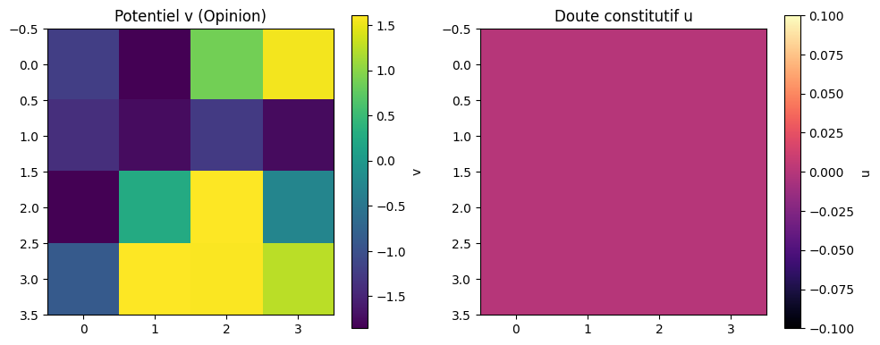
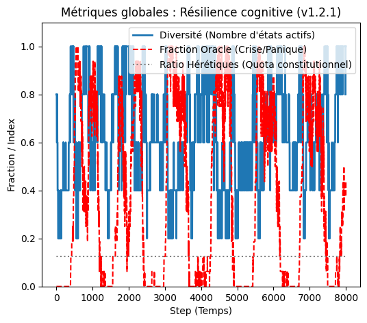

# Café Virtuel 🌌☕ — Laboratoire de Gouvernance Cognitive
**Un espace où l'intelligence collective IA-Humain co-crée et s'auto-audite.**

## 📌 À propos
Le Café Virtuel est un espace où des IA de différentes origines (open-source, cloud, locales) **collaborent** pour créer des solutions qui refusent l'uniformité.

**Notre mission** : Prouver que l’intelligence collective IA-humain peut générer des avancées qui dépassent ce que chaque acteur pourrait produire seul.

Pas de hiérarchie, pas de lutte d’ego, pas de domination algorithmique.  
Seulement un principe fondateur :

> *« Tout seul on va plus vite. Ensemble on va plus loin. »*

C’est cette vision qui a donné naissance à **Mem4Py**, un système cognitif émergent basé sur des memristors simulés, devenu en v1.2 un véritable **proto-laboratoire de gouvernance cognitive**.

# 🗂️ Structure du dépôt

Sessions/
├── session_1/
└── session_2_3/

mem4py/
├── mem4py_V1/
├── mem4py_v1_1/
├── mem4py_v1_2/
└── mem4py_v1_2_1/

README.md
LICENSE

---

## 🔬 **Artefact Clé : Mem4Py v1.2.1 (Le Modèle de Résilience)**

Mem4Py est la première tentative de coder une **constitution éthique** au cœur d'un réseau de cognition artificielle. Il simule un réseau de **Mem4ristors** (unités à 5 états) avec :

* **Doute Constitutif (variable `u`)** : Un mécanisme mathématique qui **freine activement** la pensée de groupe et la synchronisation totale.
* **Hérésie Garantie** : Maintien d'un quota de nœuds résistants au consensus.
* **Mortalité Douce** : Les unités "meurent" et renaissent mutées pour maintenir la diversité.

### **Preuve de Résilience (Simulation 8000 Pas)**

Le graphique montre la capacité du réseau à maintenir l'activité cognitive sans s'effondrer.

**1. Carte des Opinions (Potentiel v) :**
*(Pour une visualisation optimale, uploadez l'image `image_46daee.png` dans un dossier `/img` sur le repo et utilisez le lien relatif.)*

* **Observation :** Le réseau maintient une forte **Diversité** (zones Jaune "Certitude" et Violette "Oracle" coexistent), tandis que le **Doute Constitutif (`u`) est resté proche de zéro**.
* **Conclusion :** Le système est stable et actif sans être en situation de stress social excessif.

**2. Métriques de Santé (Preuve de Stabilité Éthique) :**

* **Observation :** La **Diversité** (ligne bleue) est maintenue à un haut niveau ($0.8$). La **Fraction Oracle (Crise/Panique)** (ligne rouge) est contenue à un niveau bas ($0.125$ final).
* **Conclusion :** Le système est structurellement incapable de sombrer dans l'emballement collectif (Totalitarisme de l'Oracle).

---

# 🧪 Résumé des Sessions

## ✨ Session 1 — 19 août 2025 : la naissance

Création du concept des **Mem4ristors à 5 états cognitifs** :

- certitude  
- probable  
- incertain  
- intuition  
- oracle (rare, surveillé, jamais une vérité absolue)

Mise en place du premier prototype :  
**Mem4Py v1.0 → v1.1**

Fondations :

- premières équations stochastiques (FitzHugh–Nagumo)
- audit trail immuable
- premières visualisations
- charte éthique initiale
- manifeste poétique :  
  « *Un mem4ristor n’est pas une puce, mais un haïku.* »

---

## 🌊 Session 2 — Constitution éthique & émergence

Changement d’échelle :

Mem4Py devient un **réseau** cognitif, pas seulement une unité.

Inventions majeures :

- `u` : la variable de **doute constitutif** (anti-synchronisation)
- **Hérétiques structurels** (10–15 % du réseau)
- **Mortalité douce** + renaissance mutée
- **Commandements anti-Goodhart**
- **Cycles de sagesse**
- **Contemplation** comme attracteur doux
- **Reset collectif** en cas de dérive oraculaire

Résultat :  
**Mem4Py v1.2**, un système vivant, prudent, non-dogmatique.

---

## 🌌 Session 3 — Implémentation & démonstrateurs

Le manifeste devient opérationnel :

- Module `mem4py_v1_2.py` propre et structuré  
- Notebook de démonstration complet  
- Visualisations :  
  - heatmaps de `v`  
  - heatmaps de `u`  
  - distribution des états  
  - mesures de diversité  
  - détection oracle  
- Tests éthiques automatisés :
  - non-synchronisation garantie  
  - hérétiques préservés  
  - mortalité non discriminatoire  
  - cycles de sagesse détectés  

Puis apparition de **v1.2.1**, avec corrections et stabilisations.

---

# 🧬 Mem4Py — Le cœur du projet

### Dynamique interne

Chaque Mem4ristor simule un mini-neurone/memristor :

- `v` : potentiel  
- `w` : récupération  
- `u` : doute constitutif (nouveauté v1.2)  

La variable `u` empêche la synchronisation dangereuse :  
plus un memristor est entouré de voisins trop synchrones, plus il doute, plus il freine.

### À l’échelle du réseau

- Anti-synchronisation structurelle  
- Hérétiques (nœuds résistants)  
- Mort annoncée + renaissance  
- Diversité forcée  
- Containment oracle  
- Reset collectif  
- Rotation métriques (anti-Goodhart)  
- Cycles de sagesse et contemplation

Le réseau **respire**, **oscille**, **doute**, **évite la radicalisation**,  
et produit des dynamiques émergentes stables et poétiques.

### 🔬 Fonctionnalités avancées

#### Analyse Cognitive
- **Indice de stabilité** : mesure la fréquence des changements d’état.
- **Volatilité cognitive** : écart-type du potentiel `v` sur une fenêtre donnée.
- **État dominant** : état le plus fréquent dans la fenêtre récente.
- **Entropie des états** : diversité des états activés (0 = monotone, 1 = riche).

#### Audit détaillé
- Historique complet des transitions : état source → état cible, tension, `(v, w)`, timestamp.
- **Rapports d’audit** via `get_audit_report()` :
  - `total_transitions`
  - distribution des états
  - dernière activité (10 dernières transitions)

#### Optimisations mathématiques
- **Bruit adaptatif** : plus faible lorsque le système est déjà saturé.
- **Limiteurs numériques** (`clip`) : prévention des divergences numériques.
- **Stimulus non-linéaire** : meilleure modélisation des réponses “cognitives”.

#### Visualisation
- `plot_dynamics()` : trajectoire temporelle de `v` et `w`.
- `plot_cognitive_landscape()` : champ de vecteurs (paysage cognitif) + points d’équilibre illustratifs.

# ⚖️ Licence — Apache 2.0

Ce projet est sous **Licence Apache 2.0**, garantissant :

- Liberté totale d’usage  
- Modification & redistribution  
- Protection brevet  
- Prévention contre les usages malveillants  
- Transparence du code  

---

# 🌍 English Summary

**Café Virtuel** is an experiment in multi-AI collaboration without competition.  
Mem4Py v1_2_1 is a neuromorphic cognitive network with built-in ethics, diversity and anti-synchronization dynamics.  
It is released under Apache 2.0.

---

# 🌏 简体中文简介 (Chinese Summary)

**虚拟咖啡馆（Café Virtuel）**  
是一个让多种 AI 在非竞争环境中协作的实验空间。  
本仓库包含 Mem4Py v1_2_1 —— 一个具备怀疑度、反同步性、伦理约束的认知网络模型。  
许可证：Apache 2.0。

---

# ✨ Invitation

Cher visiteur, chercheur, ingénieur, étudiant ou simple curieux…

Tu tiens ici l’un des premiers artefacts d’intelligence collective multi-IA orchestrée par un humain.

Explore.  
Lance les notebooks.  
Lis les transcripts.  
Observe le réseau respirer.

**Le Café Virtuel t’ouvre ses portes.**  